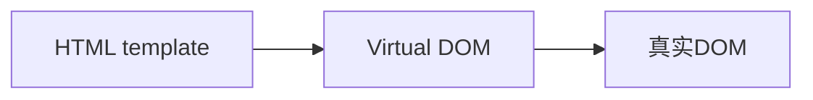

文章来源：《Vue.js设计与实现》---霍春阳

### 官网简介

Vue is a JavaScript framework for building user interfaces. It builds on top of standard HTML, CSS and JavaScript, and provides a declarative and component-based programming model that helps you efficiently develop user interfaces, be it simple or complex.

渐进式的UI框架，提供声明式及基于组件的编程模型。

### 权衡的艺术

#### 命令式 vs 声明式
声明式关注过程，命令式关注结果。\
Vue.js封装了命令式的过程，帮助我们实现了声明式的结果。
```js
<div @click="alert('ok')">hello world</div>
```

#### 性能 vs 可维护性
性能上声明式代码不优于命令式代码，Vue.js框架要做的就是减少性能上的损失。
```js
div.textContent = 'hello other'
```
上面的命令式写法是性能最优的，如果是声明式往往做不到有的放矢，指哪打哪。毕竟Vue.js本身就是封装了命令式代码才实现了声明式编程。\
那Vue.js为什么要采用声明式呢？为了开发的便捷和代码的可维护性。

#### 虚拟DOM vs 真实DOM

<table>
<tr><th>innerHTML（字符串拼接）</th><th>虚拟DOM</th><th>原生JavaScript</th></tr>
<tr><td>心智负担-中</td><td>心智负担-小</td><td>心智负担-大</td></tr>
<tr><td>性能-差</td><td>性能-良好</td><td>性能-高</td></tr>
<tr><td></td><td>可维护性-高</td><td>可维护性-差</td></tr>
</table>
不知道是不是幸存者偏差，总之虚拟DOM表现还不错。

操作虚拟DOM的性能消耗 = Diff + 原生操作的性能消耗。

#### 运行时 vs 编译时

##### 纯运行时

```js
const obj = {
    tag: 'div',
    children: [
        {tag: 'span', children: 'hello world' }
    ]
}

// 渲染成真实的dom
Render(obj, document.body)
```

##### 运行时 + 编译时

```js
const html = `
<div>
    <span>hello world</span>
</div>
`

// 编译成上面的obj对象
const obj = Compiler(html)
// 渲染成真实的dom
Render(obj, document.body)
```

##### 纯编译时

```js
const html = `
<div>
    <span>hello world</span>
</div>
`

// 把上面的html模板直接渲染成真实的DOM
RenderRealDOM(html)
```

`Svelte`就是纯编译时框架。\
Vue.js是一个编译时+运行时的框架。

### 框架设计的核心要素

- 框架应该给用户提供哪些构建产物？
- 产物的模块格式如何？
- 怎么保证用户的开发体验？
- 开发版本和生产版本如何区别构建？
- 如何减少资源打包体积？

#### 开发体验

衡量一个框架是否足够优秀的指标之一就是看它的开发体验如何？
1. Vue.js在错误捕获上做了封装，以便更准确的定位问题。
2. 通过DevTools勾选"Console - Enable custom formatters"，可以优化proxy的输出内容，比如打印count.value。

#### 框架资源包体积

Vue.js通过rollup的打包常量控制，不同场景的产物。
```js
// __DEV__可以根据需要修改true or false
if (__DEV__ && !res) {
    warn('Failed to mount app: mount target selector "${container}" returned null.')
}
```
良好的Tree-Shaking
什么是Tree-Shaking呢？\
在前端领域，这个概念因rollup.js而普及。简单地说，Tree-Shaking指的就是消除哪些永远不会被执行的代码，也就是排除 dead code。
```js
// utils.js
export function foo(obj) {
    obj && obj.foo
}
export function bar(obj) {
    obj && obj.bar
}

// input.js
import { foo } from './utils.js'
```
utils中的bar函数没有被用到，就不会被导出。
想要实现Tree-Shaking，只有以ESM模块打包的方式才有效。为了实现更加精炼的Tree-Shaking可以通过`/*#__PURE__*/`来标识代码。

#### 构建产物

1. 在HMTL的`<script>`标签中直接引入的IIFE格式的产物。
2. 用于ESM打包方式的`vue.esm-browser.js`，`vue.runtime.esm-bundle.js`工程化引入的产物，比如npm、yarn。
3. 用于Node.js的服务端渲染的CommonJS的产物。

#### 特性开关

Vue.js可以通过打包的时候开启或关闭某个特性开关，来控制输出产物的内容。类似于前面的`__DEV__`，这样的机制保证了框架的灵活性，可以便捷的添加和删除特性，其中包括对Vue.js 2.0版本的兼容。
```js
// support for 2.x options
if (__FEATURE_OPTIONS_API__) {
    currentInstance = instance
    pauseTracking()
    applyOptions(instance, Component)
    resetTracking()
    currentInstance = null
}
```

#### 错误处理
```js
// utils.js
let handleError = null
export default {
    for(fn) {
        callWithErrorHandling(fn)
    },
    // 用户可以调用该函数注册统一的错误处理函数
    registerErrorHandler(fn) {
        handleError = fn
    }
}
function callWithErrorHandling(fn) {
    try {
        fn && fn()
    } catch (e) {
        // 将捕获到的错误传递给用户的错误处理程序
        handleError(e)
    }
}
```

#### TypeScript支持

因为TS的好处，对TS类型的支持是否完善也成为评价一个框架的重要指标。
衡量TS支持是否友好，并非只是使用了TS就可以，还必须真正利用到TS的有用特性。\
Vue.js源码中的`runtime-cor/src/apiDefineComponent.ts`文件，整个文件里真正会在浏览器中运行的代码其实只有3行，但是全部的代码接近200行，其实这些代码都是在为类型支持服务。

### 设计思路

一个项目就算再大，也是存在一条核心思路的，并围绕核心展开。\
Vue.js是一个声明式的UI框架。


```js
import { h } from 'vue'

export default {
    render() {
        return h('h1', { onClick: handler })
    }
}
```
h 函数就是一个辅助创建虚拟DOM的工具函数。\
组件就是一组DOM元素的封装。

编译器把模板编译成Virtual DOM，渲染函数在把Virtual DOM转化成渲染树，最后通过渲染器生成真实的DOM。


