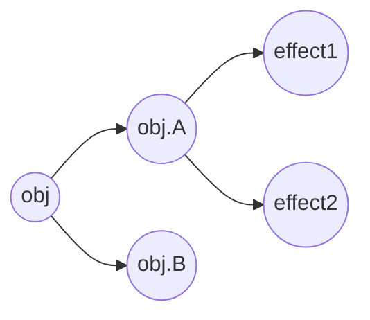
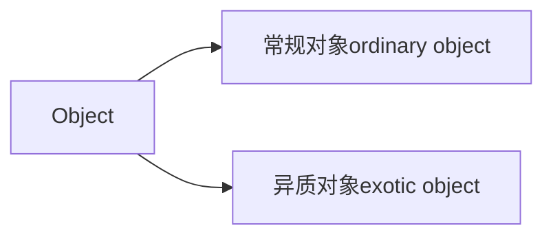

### 响应系统的作用与实现
我们知道Vue.js 3 采用Proxy实现响应式数据，这涉及语言规范层面的知识。这部分内容包括如何根据语言规范实现对数据对象的代理，以及其中的一些重要细节。

#### 响应式数据 & 副作用函数

**副作用函数**：effect 函数的执行会直接或间接影响其他函数的执行。
```js
function effect1() {
    document.body.innerText = 'hello vue 3'
}

function effect2() {
    // 全局变量
    let val = 1

    function effect() {
        val = 2 // 修改全局变量，产生副作用
    }
}
```

**响应式数据**：当一个数据发生改变时，我们希望引用到它的副作用函数自动重新执行，这样的数据被称为响应式数据。
```js
const obj = { text: 'hello world' }
function effect() {
    document.body.innerText = obj.text
}

// 修改obj.text的值，同时希望副作用函数会重新执行
obj.text = 'hello other'
```

#### 响应式数据基本实现

1. 在数据赋值时，进行拦截，并保存对应的副作用函数。
2. 在数据取值时，进行拦截，重新执行副作用函数。

具体手段：在ES2015前采用`Object.defineProperty`实现拦截，在ES2015后，采用代理对象`Proxy`实现。
```js
const bucket = new Set()

const obj = { text: 'hello world' }

const reactiveObj = new Proxy(obj, {
    get(target, key) {
        bucket.add(effect)
        return target[key]
    },
    set(target, key, newVal) {
        target[key] = newVal
        bucket.forEach(fn => fn())
        return true
    }
})
```

#### 完善的响应式系统


复杂一些的情况：对目标对象的多个属性添加多个副作用函数。
因此用于存储副作用函数的集合的数据结构变成：WeakMap - Map - Set。\
其中WeakMap的键是原始对象obj，WeakMap的值是一个Map实例，而Map的键是原始对象obj的key，Map的值是一个由副作用函数组成的Set。

WeakMap 和 Map的主要区别：
```js
const map = new Map()
const weakMap = new WeakMap()

(function() {
    const foo = {foo:1}
    const bar = {bar:2}

    map.set(foo, 1)
    weakMap.set(bar, 2)
})()
```
WeakMap是弱引用，当表达式执行完毕，会被垃圾回收。所以WeakMap经常用于存储那些只有当key所引用的对象存在时（没有被回收）才有价值的信息。

然后把副作用收集的逻辑封装到track（追踪）函数中，把触发副作用函数的逻辑封装到 trigger函数中：
```js
const obj = new Proxy(data, {
    get(target, key) {
        track(target, key)
        return target[key]
    },
    set(target, key, newVal) {
        target[key] = newVal
        trigger(target, key)
    }
})

function track(target, key) {
    // activeEffect 用来注册副作用函数的全局变量
    if (!activeEffect) return
    let depsMap = bucket.get(target)
    if (!depsMap) {
        bucket.set(target, (depsMap = new Map()))
    }
    let deps = depsMap.get(key)
    if (!deps) {
        depsMaps.set(key, (deps = new Set()))
    }
    deps.add(activeEffect)
}

function trigger(target, key) {
    const depsMap = bucket.get(target)
    if (!depsMap) return
    const effects = depsMap.get(key)
    effects && effects.forEach(fn => fn())
}
```

#### 副作用函数的依赖收集
为了避免副作用函数中的条件依赖问题：
```js
const data = { ok: true, text: 'hello world' }
const obj = new Proxy(data, { /* ... */ })

effect(function effectFn() {
    document.body.innerText = obj.ok ? obj.text : 'not'
})
```
分支切换导致冗余副作用的问题，这个问题会导致副作用函数进行不必要的更新。

#### 嵌套effect与effect栈

#### 避免无限递归循环

#### 调度执行
能够控制副作用函数的执行时机，次数，方式；这对于computed和watch的实现由重要意义。

#### 计算属性computed 与 lazy
```js
effect(
    // 指定了 lazy 选项，这个函数不会立即执行
    () => {
        console.log(obj.foo)
    },
    // options
    {
        lazy: true
    }
)
```
当options.lazy为true时，则不立即执行副作用函数。
```js
function computed(getter) {
    // 把getter作为副作用函数，创建一个 lazy 的 effect
    const effectFn = effect(getter, {
        lazy: true
    })

    const obj = {
        // 当读取 value 时才执行 effectFn
        get value() {
            return effectFn()
        }
    }

    return obj
}
```
并且可以通过 value(缓存值)、dirty、scheduler实现缓存。也就是多次访问不用重新计算。

#### watch
通过 effect 和 scheduler实现。immediate可以实现watch的立即调用。\
过期的副作用，多次watch中的异步请求，通过设置watch回调函数的第3个参数`onInvalidate`将上一次副作用标记为expired过期，避免竞态问题。

### 非原始值的响应式方案
实现响应式数据要比想象中难很多，并不是像上一章讲述的那样，单纯地拦截get/set操作即可。

#### Proxy 和 Reflect
Proxy可以创建一个代理对象，它能够实现对其他对象的代理。\
Proxy只能代理对象，无法代理非对象值，例如字符串、布尔值等。\
Proxy可以对一个对象的**基本语义**进行代理，包括`get`、`set`，也包括一些**基本操作**，也即**非复合操作**。

在JavaScript的世界里，万物皆对象。例如一个函数也是一个对象，所以调用函数也是对一个对象的基本操作。

```js
const fn = (name) => {
    console.log('我是：', name)
}

// 调用函数是对对象的基本操作
fn()

const p2 = new Proxy(fn, {
    // 使用apply 拦截函数调用
    apply(target, thisArg, argArray) {
        target,call(thisArg, ...argArray)
    }
})

ps('hcy') // 输出：'我是：hcy'
```

复合操作：
```js
obj.fn()
// 由2个操作组成
get obj.fn + 执行fn
```

Reflect 是一个全局对象，其下有许多方法：
```js
Reflect.get()
Reflect.set()
Reflect.apply()
// ...
```

Reflect.get 函数还能接收第三个参数，即指定receiver，你可以理解为函数调用过程中的this，例如：
```js
const obj = { foo: 1 }
console.log(Reflect.get(obj, 'foo', {foo: 2})) // 输出 2
```

#### 为什么要时使用Reflect
```js
const obj = {
    foo: 1,
    get bar() {
        return this.foo
    }
}

effect(() => {
    // p 是一个通过Proxy代理的对象
    console.log(p.bar)
})
```
上面调用访问器bar时，没有触发响应式。

```js
// 改造后
const p = new Proxy(obj, {
    get(target, key, receiver) {
        track(target, key)
        // target[key] 替换掉
        return Reflect.get(target, key, receiver)
    }
})
```

#### JavaScript对象 & Proxy工作原理
根据ECMAScript规范，JavaScript对象分为2种：

那么如何区分普通对象和函数呢？在JS中，对象的实际语义是由 **内部方法(internal method)** 指定的：

`[[Get]]`、`[[Set]]`、`[[Delete]]`、`[[OwnPropertyKeys]]`、`[[GetPrototypeOf]]`、`[[SetPrototypeOf]]`、`[[IsExtensible]]`、`[[PreventExtensions]]`、`[[GetOwnProperty]]`、`[[DefineOwnProperty]]`、`[[HasProperty]]`，除了这11个内部方法，还有另外2个额外的内部方法：`[[Call]]`、`[[Construct]]`。

而 **函数对象会部署内部方法`[[Call]]`**，普通对象不会。

内部方法具有多态性，也就是每个方法可以定义不同的实现。\
**常规对象满足的条件**：
- 11个内部方法按照ECMA 10.1.x规范实现
- `[[Call]]`按照ECMA 10.2.1规范实现
- `[[Construct]]`按照ECMA 10.2.2规范实现

其他的则都为**异质对象**，例如Proxy对象的`[[Get]]`方法没有使用ECMA 10.1.8实现，所以它是异质对象。

**Proxy的接口函数**：
<table style="text-align: left;">
<tr><th>内部方法</th><th>实现函数</th></tr>
<tr><th>[[Get]]</th><th>get</th></tr>
<tr><th>[[Set]]</th><th>set</th></tr>
<tr><th>[[Delete]]</th><th>deleteProperty</th></tr>
<tr><th>[[OwnPropertyKeys]]</th><th>ownKeys</th></tr>
<tr><th>[[GetPrototypeOf]]</th><th>getPrototypeOf</th></tr>
<tr><th>[[SetPrototypeOf]]</th><th>setPrototypeOf</th></tr>
<tr><th>[[IsExtensible]]</th><th>isExtensible</th></tr>
<tr><th>[[PreventExtensions]]</th><th>preventExtensions</th></tr>
<tr><th>[[GetOwnProperty]]</th><th>getOwnPropertypeDescriptor</th></tr>
<tr><th>[[DefineOwnProperty]]</th><th>defineProperty</th></tr>
<tr><th>[[HasProperty]]</th><th>has</th></tr>
<tr><th>[[Call]]</th><th>apply</th></tr>
<tr><th>[[Construct]]</th><th>construct</th></tr>
</table>

`[[Call]]`、`[[Construct]]`只有当对象是函数和构造函数时才会部署。

#### 如何代理 Object

对象上所有的读取操作：
- obj.foo
- key in obj
- for (const key in obj) {}

in对应的Proxy拦截方法时has，for...in对应的Proxy拦截方法是ownKeys。

#### 合理触发响应

- 当值没有改变时，不触发。
  ```js
    NaN === NaN // false
  ```
- 屏蔽由原型引起的更新
- 当key时Symbol类型时，不触发

#### 深响应 & 浅响应
reactive是深响应、shallowReactive是浅响应。\
reactive 是 Proxy的上层封装
```js
function reactive(obj) {
    return new Proxy(...)
}
```

然而，并非所有场景我们都希望触发深响应，例如：
```js
obj.foo.bar
```
当我们**不希望**调用第二层属性`.bar`时触发响应，这时我们就可以用 `shallowReactive`代理obj。

#### 代理数组
数组是一个**异质对象**，其`[[DefineOwnProperty]]`的内部方法实现有所不同。

数组的读取操作：
- arr[0]
- arr.length
- for...in
- for...of
- 原型方法：concat / join / every / some / find / findIndex / includes 等

数组的赋值操作：
- arr[0] = 1
- arr.length = 0
- 栈方法：push / pop / unshift / shift
- 改变原数组的方法：splice / fill / sort 等

#### 遍历数组
因为数组也是对象，所以也可以用`for...in`遍历，但是不推荐使用。

**可迭代对象**：实现了`Symbol.iterator`方法，ECMAScript用来指定迭代器的Symbol值，它执行后会默认返回一个迭代器。

Proxy代理后会导致includes、indexOf、lastIndexOf方法异常，所以需要重写这些方法。

隐式改变数组length属性，会导致循环触发副作用函数。比如`arr.push(1)`，所以需要重写push、pop、shift、unshift、splice 等方法。

#### 代理 Set 和 Map
为了支持代理，需要重写Set和Map的迭代器方法

### 原始值的响应式方案

除Object外的其他7中类型都是原始值：Boolean / Number / BigInt / String / Symbol / undefined / null。\
在JavaScript中原始值是按值传递的，而非按引用传递。形参与实参之间没有引用关系，形参的修改不会影响实参。另外，JavaScript中Proxy不提供原始类型的代理。\
所以需要对原始值进行一层包裹，这就时 `ref`。

```js
// 封装一个 ref 函数
function ref(val) {
    // 创建包裹对象
    const wrapper = {
        value: val
    }
    // 给包裹对象添加响应式
    return reactive(wrapper)
}
```
这就是为什么ref包裹对象需要通过.value来取值的原因。\
通过Object.defineProperty定义一个`__v_isRef`来区别包裹对象和普通对象。

#### 响应丢失问题
```js
<template>
    <p>{{ foo }} / {{ bar }}</p>
</template>

<script>
export default {
    setup() {
        const obj = reactive({foo: 1, bar: 2})
        return { ...obj }
    }
}
</script>
```
上面的问题我们可以通过将各个属性通过ref包装的方式解决：
```js
return { ...toRefs(obj) }
```

#### 自动去ref
为了用户在模板中调用时不使用`foo.value`，减轻用户的心智负担，可以直接用`{{ foo }}`调用。设计者对访问对象的get 方法做了处理：
```js
get (target, key, receiver) {
    const value = Reflect.get(target, key, receiver)
    return value.__v_ifRef ? value.value : value
}
```
