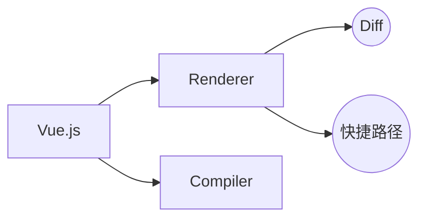
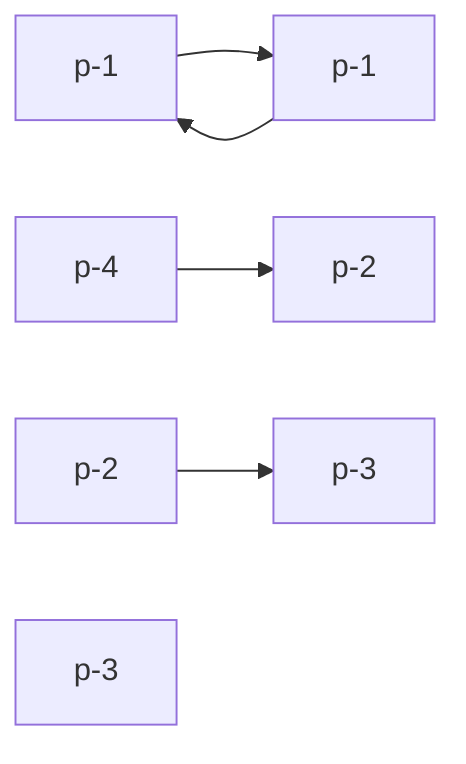

文章来源：《Vue.js设计与实现》---霍春阳

### 渲染器Renderer
Vue.js中包含了两大核心模块：编译器、渲染器。
渲染器是框架性能的核心，它的实现直接影响框架的性能。Vue.js 3 的渲染器不仅包含传统的Diff算法，还独创快捷路径的更新方式，能够充分利用编译器提供的信息，大大提升了更新性能。

渲染器是用来渲染真是DOM元素的，除此之外为了支持框架跨平台的能力，还应该考虑其支持自定义的能力。
```js
function renderer(domString, container) {
    container.innerHTML = domString
}
```

#### 与响应式系统的结合

```js
<script src="https://unpkg.com/@vue/reactivity@3.0.5/dist/reactivity.global.js"></script>

const { effect, ref } = VueReactivity

function renderer(domString, container) {
    container.innerHTML = domString
}
const count = ref(1)

effect(() => {
    renderer(`<h1>${count.value}</h1>`, document.getElementById('app'))
})
```

#### 基本概念
名词：
- render - 渲染
- renderer - 渲染器
- vdom - virtual DOM 虚拟DOM
- vnode - virtual node，树状的虚拟DOM
- mount - 挂载，渲染器把虚拟DOM渲染为真实DOM的过程
- container - 容器，挂载到该DOM节点

```js
function createRenderer() {
    function render(vnode, container) {}
    // 服务端渲染
    function hydrate(vnode, container) {}
    return {
        render,
        hydrate
    }
}

const renderer = createRenderer()
// 首次渲染
renderer.render(vnode, document.querySelector('#app'))
```

#### mount & patch
根据render的执行阶段，第一次渲染叫做挂载(mount)；第二次渲染叫做打补丁(patch)。\
根据传入null的 vnode 还可以执行卸载操作(unmount)

```js
function createRenderer() {
    function render(vnode, container) {
        if (vnode) {
            // 新的vnode存在，将其与旧的 vnode 对比，进行打补丁
            patch(container._vnode, vnode, container)
        } else {
            // 旧的 vnode 存在，新的 vnode 不存在，说明是 unmount 操作
            // 清空 container 内的 DOM 即可
            if (container._vnode) {
                container.innerHTML = ''
            }
        }
        // 缓存本次 vnode
        container._vnode = vnode
    }
}
```
**patch**函数是整个渲染器的核心入口，它承载了最重要的渲染逻辑。
```js
function patch(oldVnode, newVnode, container) {
    // ...
}
```

#### 自定义渲染器
```js
function createRenderer(options) {
    // 通过options自定义render过程
    const {
        createElement,
        insert,
        setElementText
    } = options

    function mountElement(vnode, container) {}
    function patch(n1, n2, container) {}
    function render(vnode, container) {}
}
```
自定义渲染器，可以保证浏览器和Node.js环境可以根据平台切换使用。

#### HTML标签属性 & DOM对象属性
HTML标签属性：
```js
<input class="cls" id="my-input" type="text" value="foo" />
```

<table>
<tr><th>HTML标签属性</th><th>DOM对象属性</th></tr>
<tr><td>class</td><td>className</td></tr>
<tr><td>id</td><td>id</td></tr>
<tr><td>type</td><td>type</td></tr>
<tr><td>aria-valuenow</td><td></td></tr>
<tr><td>value</td><td>value</td></tr>
<tr><td>...</td><td>...</td></tr>
</table>

```js
el.getAttribute('value') // foo
el.value // bar
el.defaultValue // foo
```
一个HTML标签属性可能关联多个DOM对象属性。\
HTML标签属性的作用是设置与之对应的DOM对象属性的初始值。

```js
patchProps(el, key, prevValue, nextValue) {
    if (shouldSetAsProps(el, key, nextValue)) {
        const type = typeof el[key]
        if (type === 'boolean' && nextValue === '') {
            el[key] = true
        } else {
            el[key] = nextValue
        }
    } else {
        el.setAttribute(key, nextValue)
    }
}
```

#### class的设置
浏览器为一个元素设置class有三种方式：
- className
- setAttribute
- classList
  
其中el.className性能最优。

Vue.js允许对象类型的值作为class是为了方便开发者，在底层实现上，必然需要对值进行正常化后再使用。而正常化是有代价的，大量正常化操作会消耗更多的性能。

#### 卸载unmount

container.innerHTML = null

这样暴力卸载有几个缺点：
- 不会触发钩子函数，包括组件和指令的
- 不会移除元素绑定的事件

所以需要封装一个unmount函数。

#### 区分 vnode 的类型

#### 事件的处理
伪造一个invoker，invoker.value保存上次绑定的事件，这样在更新事件时就不用先调用removeEventListener了。

#### 事件冒泡
通过invoker.attached属性，用来存储事件处理函数被绑定的时间（高精时间performance.now），通过invoker.attached 与 e.timeStamp（事件触发的时间）比较来屏蔽所有绑定时间晚于事件触发时间的回调函数的执行。

#### 更新子节点
子节点的数据结构有3种情况：
- null
- 文本
- 数组（一个或多个子节点）

#### 文本节点和注释节点
这两种节点不具有标签名称，所以我们需要人为创造一些唯一标识，并将其作为注释节点和文本节点的type属性值：
```js
// 文本节点的 type 标识
const Text = Symbol()
const newVnode = {
    type: Text,
    children: '文本'
}

// 注释节点的 type 标识
const Comment = Symbol()
const newVnode = {
    type: Comment,
    children: '注释'
}
```

#### Fragment
在Vue.js 2 中不允许组件模板存在多个根节点，比如：
```js
<template>
    <li></li>
    <li></li>
    <li></li>
</template>
```
在 Vue.js 3 中通过 Fragment，可以使用多根节点模板：
```js
const Fragment = Symbol()
const vnode = {
    type: Fragment,
    children: [
        {type: 'li', children: 'text 1'},
        {type: 'li', children: 'text 2'},
        {type: 'li', children: 'text 3'}
    ]
}
```
与文本和注释节点类似，Fragment也没有所谓的标签名称，因此我们也需要创建唯一标识。\
Fragment本身不渲染任何内容，只会渲染Fragment的子节点。

### 简单的Diff算法
我们知道，操作DOM的性能开销通常比较大，而渲染器的核心Diff算法就是为了解决这个问题诞生的。

#### 减小DOM操作性能开销
原始流程：卸载旧的子节点，再挂载新的子节点。
改进流程：先取新旧两组子节点长度较短的一组，对比更新修改，再判断删除或新增子节点。

#### DOM复用 & key 的作用
```js
// old children
[
    {type: 'p'},
    {type: 'div'},
    {type: 'span'}
]

// new children
[
    {type: 'span'},
    {type: 'p'},
    {type: 'div'}
]
```
上面的情况仍然需要6次更新。但是经过判断，我们发现只要移动节点位置，就可以减小性能开销。\
为了精确的确认新旧两组子节点中，存在相同的节点，我们采用给每个节点定义key的方式，key 属性就像虚拟节点的“身份证”号一样。

### 双端 Diff 算法
将新旧两组的头和尾进行比较：
```js
while (oldStartIdx <= oldEndIdx && newStartIdx <=newEndIdx) {
    if (oldStartVnode.key === newStartVnode.key) {
        // 调用 patch 函数再 oldStartVnode 与 newStartVnode 之间打补丁
        patch(oldStartVnode, newStartVnode, container)
        // 更新相关索引，指向下一个位置
        oldStartVnode = oldChidren[++oldStartIdx]
        newStartVnode = newChidren[++newStartIdx]
    } else if (oldEndVnode.key === newEndVnode.key) {
        patch(oldEndVnode, newEndVnode, container)
        oldEndVnode = oldChildren[--oldEndIdx]
        newEndVnode = newChildren[--newEndIdx]
    } else if (oldStartVnode.key === newEndVnode.key) {
        patch(oldStartVnode, newEndVnode, container)
        insert(oldStartVnode.el, container, oldEndVnode.el.nextSibling)

        oldStartVnode = oldChildren[++oldStartIdx]
        newEndVnode = newChildren[--newEndIdx]
    } else if (oldEndVnode.key === newStartVnode.key) {
        patch(oldEndVnode, newStartVnode, container)
        insert(oldEndVnode.el, container, oldStartVnode.el)

        lodEndVnode = oldChildren[--oldEndIdx]
        newStartVnode = newChildren[++newStartIdx]
    }
}
```
使用双端Diff算法，可以进一步减少DOM操作的次数。

### 快速 Diff 算法

**快捷路径**：如果两段文本全等，那么就无须进入核心Diff算法了。
```js
if (text1 === text2) return
```

**文本的前缀和后缀**
```js
I use vue for app development
I use react fro app development
```

快速 Diff 算法借鉴了纯文本 Diff 算法中预处理的步骤。



步骤一：对比前置节点
从新旧组第一项开始，直到遇到不同的节点为止。
```js
j = 0
while(a.key === b.key) {
    // 更新节点
    patch(a, b, container)
    j++
    a = o_list[j]
    b = n_list[j]
}
```

步骤二：对比后置节点
由于新旧两组length不同，所以需要两个索引oldEnd、newEnd。
```js
oldEnd = o_list.legnth - 1
newEnd = n_list.length - 1
while(a.key === b.key) {
    patch(a, b, container)
    oldEnd--
    newEnd--
    a = o_list[oldEnd]
    b = n_list[newEnd]
}
```

步骤三：找出新增节点
case 1：oldEnd < j
case 2：newEnd >= j

那么 newEnd >= x >= j，这之间的就是新增节点。
以新子节点组的最后一个相同的元素(`n_list[newEnd + 1]`)为锚点，挂载 j 到 newEnd间的新增节点
```js
if (j > oldEnd && j <= newEnd) {
    const anchorIndex = newEnd + 1
    const anchor = anchorIndex < n_list.length ? n_list[anchorIndex].el : null
    while(j <= newEnd) {
        patch(null, n_list[j++], container, anchor)
    }
}
```

步骤四：找出删除节点

case 1：j > newEnd
case 2：j <= oldEnd

```js
if (j > oldEnd && j <= newEnd) {
    // 步骤四中的代码
} else if (j > newEnd && j <= oldEnd) {
    // 卸载 j -> oldEnd 之间的节点
    while(j <= oldEnd) {
        unmount(o_list[j++])
    }
}
```

最后一步：处理其他情况
```js
if (j > oldEnd && j <= newEnd) {
    // 步骤四中的代码
} else if (j > newEnd && j <= oldEnd) {
    // 步骤五中的代码
} else {
    // 其他情况
}
```
关于剩余情况的处理，值得注意的是，
简单 Diff、双端 Diff、快速 Diff 都遵循同样的处理规则：
- 优先移动节点
- 添加 或 删除 节点
  
TODO
