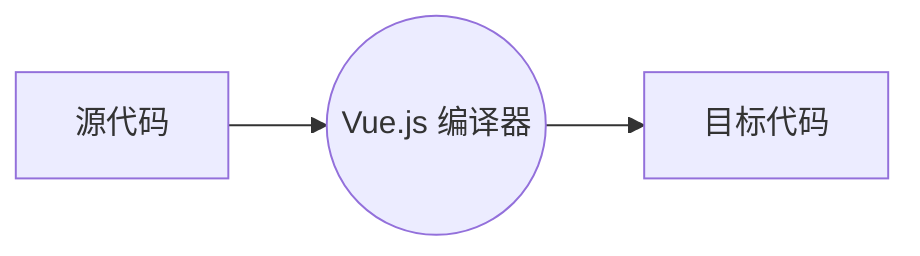
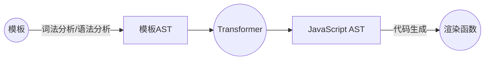
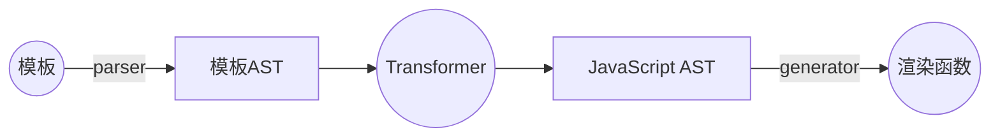
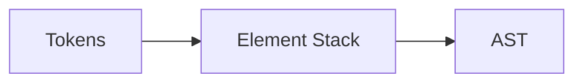

文章来源：《Vue.js设计与实现》---霍春阳

### 编译器的核心技术原理
编译技术是一门博大精深的技术，不同用途的编译技术的难度和深度都不一样。如果你要实现诸如 C、JavaScript 这类通用用途语言，那么就需要掌握较底层编译技术知识。\
Vue.js 的模板和JSX都属于领域特定语言(DSL)，它们的实现难度属于中、低级别，只要掌握基本的编译技术理论即可实现这些功能。

#### 模板 DSL 编译器
编译器其实就是一段程序，它将“一种语言A” 翻译成 “另一种语言B”，也就是源代码翻译成目标代码，中间的翻译过程就叫 **编译**。\
完整的编译过程包括：词法分析、语法分析、语义分析、中间代码生成、优化、目标代码生成 等步骤。

Vue.js 模板编译过程：




AST 是 abstract syntax tree，抽象语法树。
```js
<div>
    <h1 v-if="ok">Vue Template</h1>
</div>
```
它的AST：
```js
const ast = {
    // 根节点
    type: 'Root',
    children: [
        {
            // div 标签节点
            type: 'Element',
            tag: 'div',
            children: [
                // h1 标签节点
                type: 'Element',
                tag: 'h1',
                props: [
                    // v-if 指令
                    type: 'Directive',
                    name: 'if',
                    exp: {
                        // 指令的表达式
                        type: 'Expression',
                        content: 'ok'
                    }
                ]
            ]
        }
    ]
}
```


parser：解析器，将模板字符串解析成模板AST。
transformer：转换器，模板AST 转换成 JavaScript AST。
generator：生成器，JavaScript AST 生成 渲染函数。

#### 模板 转换成 AST
对于通用用途语言(GPL)来说，例如 JavaScript 这样的脚本语言，想要为其构造 AST，较常用的一种算法叫做 **递归下降算法**，这里面需要解决 GPL 层面才会遇到的很多问题，例如最基本的运算符优先级问题。

Vue.js 的模板构造 AST 是一件很简单的事，因为 HTML 的格式非常固定，标签之间是树形结构的，这样的结构和AST是“同构”的。
```js
<div>
    <p>Vue</p>
    <p>Template</p>
</div>
```
```js
const ast = {
    tag: Root
    childre: {
        tag: div,
        children: [
            { tag: p },
            { tag: p }
        ]
    }
}
```

构建 AST 的过程：

- 顺序遍历 parser 解析的 tokens
- 遇到开始token，将标签 压入 标签栈
- 添加 AST 子节点
- 遇到结束token，标签栈 弹出 标签
- 返回根节点
  
##### parser
```js
<p>Vue</p>
```
解析器会把这段字符串切割为三个 Token。
- `<p>`
- Vue
- `</p>`
解析器是如何进行切割的呢？**有限状态自动机**。
它的工作流程是：从第一个字符开始，随着读取字符向后推移，状态机会进入不同的状态。经过一系列状态迁移的过程之后，最终得到相应的 Token。
```js
// 定义状态机的状态
const state = {
    initial: 1, // 初始状态
    tagOpen: 2, // 标签开始状态
    tagName: 3, // 标签名称状态
    text: 4, // 文本状态
    tagEnd: 5, // 结束标签状态
    tagEndName: 6 // 结束标签名状态
}

// 对模板字符串 标记化
tokenized(str) {
    let currentState = State.initial
    const tokens = []
    const chars = []

    while(str) {
        const char = str[0]
        // 标记过程
        // ...
        str = str.slice(1)
    }

    return tokens
}
```
我们可以 通过 **正则表达式** 来优化 tokenized 函数的代码，实际上 正则表达式 的本质就是有限状态自动机。

解析 HTML 并构造 Token 的过程是有规范可循的。在 WHATWG 发布的关于浏览器解析 HTML 的规范中，详细阐述了状态迁移过程。

##### 节点的访问
采用深度优先遍历算法，访问 AST 的每一个节点

```js
function transform(ast) {
    const context = {
        nodeTransforms: [
            transformElement, // 转换标签工具函数
            transformText // 转换文本工具函数
        ]
    }
    // 遍历节点
    traverseNode(ast, context)
    // 输出 ast 信息
    console.log(dump(ast))
}

function transformElement(node) {
    if (node.type === 'Element' && node.tag === 'p') {
        node.tag = 'h1'
    }
}

function transformText(node) {
    if (node.type === 'Text') {
        node.content = node.content.repeat(2)
    }
}
```

##### 转换上下文

Context: 
- React.createContext，允许组件树件访问该上下文
- Vue.js 通过 provide / inject 能力，向一整棵树提供数据
- Koa 的中间件函数通过上下文来访问相同的数据

可以看出，上下文其实就是在 **某个范围内可访问的“公有变量”**。

转化上下文中可以保存如下数据：
- 当前转换的节点
- 当前转换节点的父节点
- 当前转换节点是第几个？
- ...

#### 模板 AST 转换为 JavaScript AST
```js
const ast = {
    tag: Root
    childre: {
        tag: div,
        children: [
            { tag: p },
            { tag: p }
        ]
    }
}
```
最终目标：
```js
function render() {
    return h('div', [
        h('p', 'Vue'),
        h('p', 'Template')
    ])
}
```
前面我们把模板转换成了模板 AST，然后我们需要把模板 AST转换成JavaScript AST，最后由 JavaScript AST 生成最终目标（渲染函数）

JavaScript AST:
```js
const FunctionDeclareNode = {
    type: 'FunctionDeclare',
    id: {
        type: 'Identifier',
        name: 'render'
    },
    param: [],
    body: [
        {
            type: 'ReturnStatement',
            return: null
        }
    ]
}
```
目标函数中，h函数的调用可以表示为：
```js
const callExp = {
    type: 'CallExpresstion',
    callee: {
        type: 'Identifier',
        name: 'h'
    },
    // 参数
    arguments: []
}
```
而它有两个参数，第一个是字符串，第二个是一个数组
```js
function render() {
    return h('div', [/*...*/])
}
```
字符串可表示为：
```js
const Str = {
    type: 'StringLiteral',
    value: 'div'
}
```
数组可表示为：
```js
const Arr = {
    type: 'ArrayExpression',
    elements: []
}
```

#### JavaScript AST 生成渲染函数代码
```js
function compile(tempate) {
    // 模板
    const ast = parse(template)
    // 模板 AST -> JavaScript AST
    transform(ast)
    // 代码生成
    const code = generate(ast.jsNode)

    return code
}
```
```js
function render() {
    return h('div', [h('p', 'Vue'), h('p', 'Template')])
}
```

### 解析器 Parser
- 浏览器是如何对 HTML 进行解析的？
- 一些特殊的状态，例如DATA、CDATA、RCDATA、RAWTEXT 等，是什么含义？
- Vue.js 模板解析器如何处理 HTML 实体？
  
#### DATA、CDATA、RCDATA、RAWTEXT
解析器的初始模式是 DATA 模式，Vue.js 模板中不允许出现`<script>` 标签，因此遇到`<script>` 会切换到 RAWTEXT 模式。\
遇到 `<title>`、`<textarea>` 会切换到 RCDATA 模式。\
遇到 `<style>`、`<xmp>`、`<iframe>`、`<noembed>`、`<noframes>`、`noscript` 会切换到 RAWTEXT 模式。\
遇到 `<![CDATA[` 字符串时，会切换到 CDATA 模式。该标签内部的内容不作解析，保持原样。

#### 递归下降算法构造模板AST
```js
const TextModes = {
    DATA: 'DATA',
    RCDATA: 'RCDATA',
    RAWTEXT: 'RAWTEXT',
    CDATA: 'CDATA'
}

function parse(str) {
    // 解析器的初始模式是 DATA 模式
    const context = {
        source: str,
        mode: TextModes.DATA
    }
    // param1: 上下文, param2: 父节点构成的栈
    const nodes = parseChildren(context, [])

    return {
        type: 'Root',
        children: nodes
    }
}
```
元素的子节点可以是以下几种：
- 标签，如 `<div>`
- 插值文本， 如 `{{ val }}`
- 文本，如 text
- 注释，如 `<!-- -->`
- CDATA 节点， 如 `<![CDATA[ xxx ]]`

#### 状态机
parseChildren函数本质上是一个状态机，它会开启一个 while 循环是的状态机自动运行：
```js
function parseChildren(context, ancestors) {
    let nodes = []
    const { mode } = context
    // 运行状态机
    while(!isEnd(context, ancestors)) {
        // ...
    }

    return nodes
}
```
停止状态机：
- 模板内容解析完毕
- 解析到顶栈节点时结束
```js
function isEnd(context, ancestors) {
    if (!context.source) return true

    const parent = ancestors[ancestors.length - 1]
    if (parent && context.source.startWith(`</${parent.tag}`)) {
        return true
    }
}
```

#### 解析标签节点

#### 解析属性

#### 解析文本

#### 解码命名字符引用
```js
<div>A$lt;B</div>

// namedCharacterReference，共2000+
{
    'GT': '>',
    'gt': '>',
    'LT': '<',
    'lt': '<',
    // ...
}
```

#### 解码数字字符引用
数字字符引用的格式：前缀 + Unicode 码点。
```js
const CCR_REPLACEMENTS = {
    0x80: 0x20ac,
    // ...
}
```

#### 解析插值 & 注释
```js
// 插值节点
{
    type: 'Interpolation',
    content: [
        type: 'Expression',
        content: ' bar '
    ]
}
// 注释节点
{
    type: 'Comment',
    content: ' commnet content '
}
```

### 编译优化
优化的一般方向：尽可能地区分动态内容和静态内容，并针对不同的内容采用不同的策略。

在渲染阶段，虚拟DOM是为了减少操作真实DOM产生的性能开销，那么如何进一步减少虚拟DOM产生的性能开销？\
虚拟DOM会进行Diff算法来优化操作DOM的次数，但是有的情况并没有必要进行Diff比较，而这些 **不需要Diff** 的情况，可以在编译阶段标记，并传递给渲染器 Renderer。

#### Block & patchFlag
```js
<div>
    <div>foo</div>
    <p>{{ bar }}</p>
</div>
```
理想情况下，我们只需要更新 p 标签的文本节点即可。
```js
const vnode ={
    tag: 'div',
    children: [
        { tag: 'div', children: 'foo' },
        // 通过 patchFlag 标识这是动态节点
        { tag: 'p', children: ctx.bar, patchFlag: 1 }
    ]
}

const PATCH_FLAGS = {
    TEXT: 1, // 文本会动态变化
    CLASS: 2, // class会动态变化
    STYLE: 3, // style会动态变化
    // ...
}
```
将动态子节点存到 dynamicChildren 数组内：
```js
const vnode ={
    tag: 'div',
    children: [
        { tag: 'div', children: 'foo' },
        // 通过 patchFlag 标识这是动态节点
        { tag: 'p', children: ctx.bar, patchFlag: PatchFlag.TEXT }
    ],
    dynamicChildren: [
        // Block 可以收集所有动态子节点
        { tag: 'p', children: ctx.bar, patchFlag: PatchFlag.TEXT }
    ]
}
```

#### 收集动态节点
```js
render() {
    return createVNode('div', {}, [
        createVNode('div', {}, [
            createVNode('div', {}, [
                createVNode('div', {}, [
                    createVNode('div', { class: 'bar' }, text, PatchFlags.TEXT)
                ])
            ])
        ])
    ])
}
```
当外层createVNode 函数执行时，内层的 createVNode 函数已经执行完毕。因此，为了让外层 Block 节点能收集到内层动态节点，就需要一个栈结构的数据来临时存储内层的动态节点：
```js
const dynamicChildrenStack = []
let currentDynamicChildren = null
function openBlock() {
    dynamickChildrenStack.push(currentDynamicCHildren = [])
}
function closeBlock() {
    currentDynamicCHildren = dynamicChildrenStack.pop()
}
```

#### 渲染器的运行时支持
有了动态节点集合 `vnode.dynamicChildren` 和 `pathFlag`，就可以在渲染器中实现按需更新了。

##### 静态提升
将纯静态节点的创建提升到渲染函数外，这样渲染函数内就是静态节点的引用，当响应式数据变化重新渲染时，就不会重新创建静态节点，从而避免额外的性能开销。
```js
// 静态节点创建提升
const staticNode = createVNode('p', null, 'text')

function render() {
    return (openBlock(), createBlock('div', null, [
        staticNode,
        createVNode('p', null, ctx,title, PatchFlags.TEXT)
    ]))
}
```

##### 预字符串化
大量的静态节点，又可以进一步将其序列化为一个字符串，通过innerHTML进行设置。
```js
<div>
    <p></p>
    <p></p>
    <p></p>
    // ...
    <p></p>
</div>
```
```js
const staticHTML = createStaticVNode('<p></p><p></p><p></p><p></p>')

render() {
    return (openBlock(), createBlock('div', null, [ staticHTML ]))
}
```
这么做的优势：
- 大块静态内容通过 innerHTML 设置，减少性能消耗
- 减少创建虚拟节点的开销
- 减少内存开销

#### 缓存内联事件处理函数

#### v-once
绑定v-once 缓存组件的创建，从而提升更新性能。
