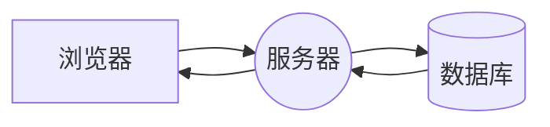

文章来源：《Vue.js设计与实现》---霍春阳

### 同构渲染
Vue.js 可以在浏览器运行，也可以在 Node.js 环境中运行。
Vue.js 作为现代前端框架，不仅能够独立地进行CSR 或 SSR，还能够两者结合，形成所谓的同构渲染(isomorphic rendering)。

#### SSR


#### CSR
有别于服务端渲染的服务器直接返回 **生成好的HTML** 内容，客户端渲染则只从服务器获取css/js 文件资源，然后在客户端（浏览器）执行文件，在 **浏览器生成HTML** 页面内容。

#### 同构渲染
那么，我们能否融合 SSR 与 CSR 两者的优点于一身呢？答案是：“可以的”。\
同构 一词的含义是：同样一套代码即可在服务端运行，也可以在客户端运行。

首次渲染：整个页面的内容是在服务端完成渲染的，不同的是同构渲染会把 **数据** 和 **静态HTML页面** 一并发送给客户端。

在解析到静态HTML页面中 `<link>` 和 `<script>` 后，浏览器会从服务端或者 CDN 获取资源，这一步与 CSR 一致。在 JavaScript 资源加载完毕后，会进行激活操作。

在 Vue.js 中，这包含2步：
- 已经渲染的DOM 与 虚拟DOM建立关联
- 提取服务端序列化后的数据，用以初始化整个 Vue.js 应用

激活完成后，整个应用程序已经完全被 Vue.js 接管为 CSR 应用程序了。

##### 将虚拟DOM 渲染为 HTML
```js
const ElementVNode = {
    type: 'div',
    props: {
        id: 'foo'
    },
    children: [
        { type: 'p', children: 'hello' }
    ]
}

function renderElementVNode(vnode) {
    // 返回渲染后的 HTML 字符串
    // <html><div> text </div></html>
}
```

##### 将组件渲染为 HTML
```js
function renderComponentVNode(vnode) {
    let { type: { setup } } = vnode
    const render = setup()
    const subTree = render()
    return renderElementVNode(subTree)
}
```

##### 客户端激活
对于同构渲染来说，组件代码会在服务端和客户端分别执行一次。\
当组件代码的客户端执行时，会再次创建 DOM 元素吗？答案是“不会”。
这时客户端会做2件事：
- 建立页面中 DOM 元素与虚拟节点对象的关联
- 绑定 DOM 事件

具体实现：真实 DOM 元素与虚拟 DOM 对象都是树形结构，并且节点之间存在一一对应的关系，因此，我们可以认为它们是“同构”的。
```js
renderer.hydrate(vnode, container)
```
```js
const html = renderComponentVNode(compVNode)

const container = document.querySelector('#app')
container.innerHTML = html

renderer.hydrate(compVNode, container)
```
```js
function hydrate(vnode, container) {
    hydrateNode(container.firstChild, vnode)
}
```
```js
function hydrateNode(node, vnode) {
    const { type } = vnode
    // 让vnode.el 引用 真实 DOM
    vnode.el = node

    // 返回下一个兄弟节点，以便继续激活
    return node.nextSibling
}
```

##### 编写同构代码
因为需要代码能在客户端和服务端都能运行，所以应该额外注意不同运行环境中代码实现的差异。

**区分环境**：
```js
created() {
    if (!import.meta.env.SSR) {
        this.timer = setInterval(() => {
            // ...
        }, 1000)
    }
}
```

**使用跨平台的API**
```js
if (!import.meta.env.SSR) {
    window.xxx
}
```

**只在某一端引入模块**

**避免多用户请求的状态污染**

**`<ClientOnly>`组件**
